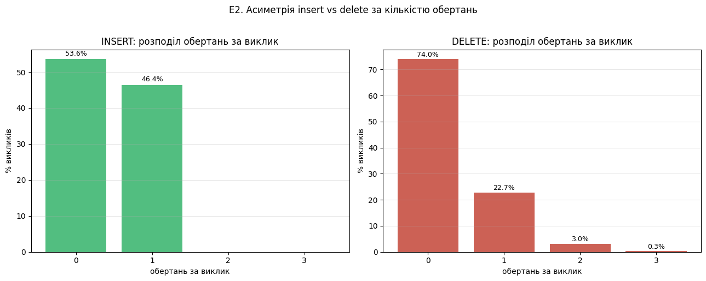
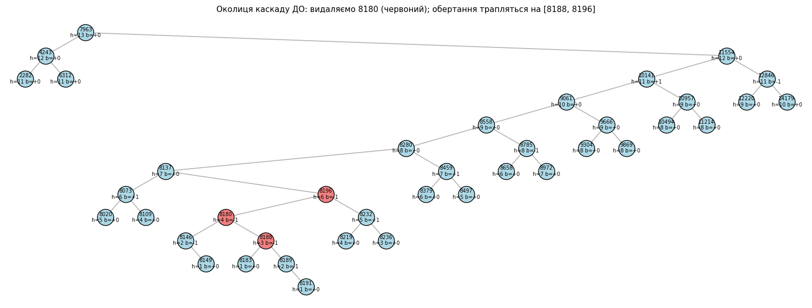
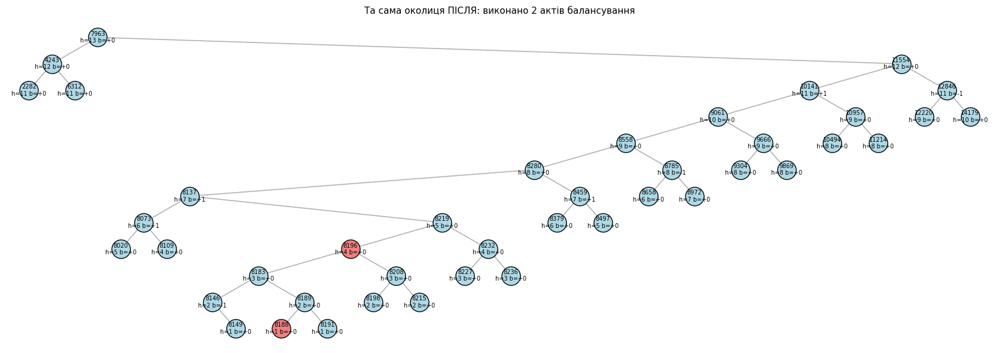

# AVL: чому `delete` потенційно дорожчий за `insert`

Поглиблений розбір однієї з найбільш контрінтуїтивних властивостей
AVL-дерева — асиметрії між вставкою і видаленням за кількістю обертань.

## Анотація

`insert` і `delete` у AVL виглядають дуже схожими: обидва спускаються
рекурсивно, виправляють баланс після зміни, повертають оновлене дерево.
Але є **фундаментальна асиметрія**:

> **Insert** ніколи не виконує більше **1 акту балансування** за один виклик.
> **Delete** може каскадно потребувати до **`O(log n)`** обертань підряд —
> по одному на кожен предок аж до кореня.

Цей репозиторій:

1. **Теоретично** пояснює, чому саме `delete` веде себе так, а `insert` ні.
2. **Емпірично** перевіряє це на AVL з 5000 вершин: рахує обертання на
   кожен виклик і порівнює розподіли.
3. **Візуально** доводить — знаходить на живому дереві видалення з
   максимальним каскадом і показує його покроково.
4. Розглядає **практичні наслідки** — чому це впливає на вибір між
   AVL і Red-Black tree в індустрії.

## Структура репозиторію

```
avl-asymmetry-experiment/
├── avl_asymmetry/             # пакет із реалізацією
│   ├── avl.py                 # AVLNode, insert, delete_node, обертання
│   ├── tracked.py             # інструментовані варіанти (рахують обертання)
│   ├── trace.py               # delete з покроковим друком кожного обертання
│   └── visualization.py       # in-order візуалізація + витяг "околиці каскаду"
├── experiments/
│   ├── 01_empirical_distribution.py   # Розділ 2 — гістограми обертань
│   └── 02_cascade_demo.py             # Розділ 3 — візуалізація каскаду
├── notebooks/
│   └── avl_experiment_assymetry.ipynb # оригінальний дослідницький ноутбук
├── tests/
│   └── test_avl.py            # smoke-тести AVL-інваріанта
├── assets/                    # збережені графіки експериментів
├── pyproject.toml
├── requirements.txt
├── LICENSE
└── README.md
```

## Встановлення і запуск

```bash
git clone https://github.com/MarynaShavlak/avl-asymmetry-experiment.git

cd avl-asymmetry-experiment

python -m venv .venv
source .venv/bin/activate          # Windows: .venv\Scripts\activate
pip install -r requirements.txt

# Експеримент 1: розподіл обертань insert vs delete
python -m experiments.01_empirical_distribution

# Експеримент 2: візуальна демонстрація каскаду
python -m experiments.02_cascade_demo

# Тести
pytest tests/
```

---

## Розділ 1. Теорія: чому асиметрія неминуча

### Теоретичне твердження (Adelson-Velsky & Landis, 1962)

> При **вставці** в AVL-дерево потрібно не більше **одного** акту
> балансування (одне обертання LL/RR, або одне подвійне LR/RL — кожне
> рахується як один акт).
>
> При **видаленні** обертання можуть **каскадувати** — потенційно до
> `O(log n)` обертань підряд на шляху до кореня.

### Чому insert обмежений 1 обертанням

Подивись на висоту піддерева **до** і **після** вставки + обертання:

```
1. ДО вставки:       висота піддерева = h
2. ПІСЛЯ вставки:    висота = h або h+1 (новий листок на найдовшій гілці чи ні)
3. Якщо стала h+1 і десь |balance| = 2 → обертання
4. ПІСЛЯ обертання:  висота повертається до h
```

Ключове твердження: **після insert-обертання висота піддерева завжди
повертається до того, що було до вставки**.

Подивись на схему LL-обертання:

```
ДО обертання (після вставки):           ПІСЛЯ right_rotate(A):

        A   (h = k+2)                          B   (h = k+1)
       /                                      / \
      B   (h = k+1)                          C   A
     /                                            ↑
    C   (h = k, з новим вузлом)        h(A) = h(C-sibling) + 1 = k+1
                                       h(B) = max(h(C), h(A)) + 1 = k+1
```

Висота нового кореня `B` дорівнює `k+1` — **те саме**, що було у `A`
ДО вставки. Батько `A` не бачить різниці у висоті свого піддерева →
у нього баланс не зміниться → перевірка `|balance| ≥ 2` не спрацює →
обертань більше не буде.

**Це закриває питання.** `insert` робить максимум 1 обертання за виклик.

### Чому delete МОЖЕ каскадувати

Симетрична схема для delete:

```
1. ДО видалення:     висота = h
2. ПІСЛЯ видалення:  висота = h або h-1
3. Якщо стала h-1 і десь |balance| = 2 → обертання
4. ПІСЛЯ обертання:  висота = h-1 АБО h-2  (!)
```

Ось де ховається проблема — крок 4. Розглянь два підвипадки.

**Випадок А — «дружній»** (`get_balance(child) == 0`):

```
ДО видалення:                          ПІСЛЯ right_rotate(A):

        A   (h = k+2)                          B   (h = k+1)
       / \                                   / \
      B   T_R (стала h = k-1)              T1   A
     / \                                       / \
    T1  T2                                    T2  T_R
   h=k  h=k                                   h=k h=k-1
                                              h(A) = k+1
                                              h(B) = k+2  ← БЕЗ змін!
```

Висота піддерева залишилась `k+2` — як до видалення. **Каскаду не буде.**

**Випадок Б — «небезпечний»** (`get_balance(child) > 0` у тому ж напрямку):

```
ДО видалення:                          ПІСЛЯ right_rotate(A):

        A   (h = k+2)                          B   (h = k+1)
       / \                                   / \
      B   T_R (стала h = k-1)              T1   A
     / \                                   h=k  / \
    T1  T2                                     T2  T_R
   h=k  h=k-1                                  h=k-1 h=k-1
                                              h(A) = k
                                              h(B) = k+1   ← НА 1 МЕНШЕ!
```

Висота піддерева стала `k+1` замість `k+2` → батько бачить, що його
піддерево раптом скоротилось → у нього теж може бути `|balance| ≥ 2` →
ще одне обертання → і так далі по ланцюгу.

### Підсумкова таблиця

| Аспект | insert | delete |
|--------|--------|--------|
| Що робить операція | додає 1 вузол | видаляє 1 вузол |
| Висота піддерева змінюється на | 0 або +1 | 0 або -1 |
| Обертання після порушення | завжди відновлює h | може зменшити h ще на 1 |
| Сумарна зміна висоти на батьківському рівні | 0 | 0 або -1 |
| Може каскадувати? | **ні** | **так** |

Інтуїтивно: `insert` тільки **росте** дерево, тому дисбаланс симетричний —
одне обертання його повністю компенсує. `delete` тільки **скорочує**
дерево, і якщо скорочення накладається на вже існуючий перекіс —
ефект подвоюється і поширюється вгору.

---

## Розділ 2. Емпірична перевірка теорії

Будуємо AVL з `N=5000` випадкових ключів, рахуємо обертання за кожен
виклик `insert`. Потім видаляємо половину у випадковому порядку,
рахуємо обертання за кожен `delete`. Порівнюємо розподіли.

**Запуск:** `python -m experiments.01_empirical_distribution`

### Результати

```
INSERT (N=5000 викликів):
  макс. обертань за виклик: 1
  середнє:                 0.464
  розподіл: {0: 2679, 1: 2321}

DELETE (N=2500 викликів):
  макс. обертань за виклик: 3
  середнє:                 0.296
  розподіл: {0: 1849, 1: 568, 2: 76, 3: 7}
```



### Інтерпретація чисел

| Спостереження | Що означає |
|---------------|-------------|
| INSERT max = **1** | Точно як в теорії — caps в одиниці незалежно від розміру дерева |
| INSERT середнє ≈ 0.46 | Десь половина вставок не потребує балансування, друга половина — рівно 1 |
| DELETE max = **3** | На цьому дереві максимальний реальний каскад — 3 обертання. Теоретично можливо `O(log n) ≈ 13`, але реалізовується тільки на спеціально побудованих структурах (Fibonacci-дерево) |
| DELETE: 22.7% мають 1 обертання | Найчастіший «небанальний» випадок — одне виправлення без каскаду |
| DELETE: 3% мають 2 | Випадок Б спрацював двічі — рідко, але показово |
| DELETE: 0.3% мають 3 | Випадок Б тричі підряд — рідкісне явище на випадкових даних |
| DELETE середнє ≈ 0.30 | Менше, ніж insert, бо багато видалень — внутрішніх вузлів через `min_value_node`, реально закінчується видаленням листка, а листки часто не порушують балансу |

Розподіл **геометричний** (експоненційно спадаючий): ймовірність каскаду
глибини `k` приблизно у 5-10 разів менша за глибину `k-1`. Це означає,
що теоретичний worst-case `O(log n)` досягається на **експоненційно
малій частці** реальних видалень.

---

## Розділ 3. Візуальний доказ каскаду

Знаходимо на нашому ж дереві видалення, що тригерить максимальний
каскад, і дивимось покроково:
- візуалізуємо дерево **ДО** видалення (з підсвічуванням ключа під видалення);
- виконуємо `delete` з трасуванням кожного обертання — друкуємо, на
  якому вузлі і якого типу;
- візуалізуємо дерево **ПІСЛЯ**.

**Запуск:** `python -m experiments.02_cascade_demo`

### Результати

```
Дерево має 2500 вершин, висота = 13
Перевіряємо 500 випадкових ключів на каскад...

Топ-10 ключів за каскадом:
  ключ   8180: 2 обертань
  ключ   3100: 2 обертань
  ключ   9489: 2 обертань
  ...

Обираємо для демонстрації ключ 8180 → каскад 2 обертань

=== Виконуємо delete(8180) ===

  ↻ #1: RR навколо вузла 8188 (balance тут був -2)
  ↻ #2: RL (подвійне) навколо вузла 8196 (balance тут був -2)

=== Підсумок ===
Видалено ключ: 8180
Актів балансування: 2
Висота дерева ДО:    13
Висота дерева ПІСЛЯ: 13
```

**Околиця каскаду ДО:**


**Та сама околиця ПІСЛЯ:**


### Що видно на картинках і в трасуванні

1. **Чому показано «вирізку», а не повне дерево.** Наше дерево має
   ~2500 вершин — намалювати їх усі не лише довго (matplotlib захлинається),
   а й безглуздо: точки зіллються в смугу. Тому функція
   `extract_cascade_view` витягує **тільки околицю** каскаду — повний шлях
   від кореня до видаленого листка плюс найближче піддерево навколо нього
   (~40 вершин). На картинці не видно цілого дерева, але саме область,
   де щось змінилось — на повний зріст.

2. **Червоний листок у дереві ДО** — це ключ, який ми видаляємо. Червоні
   внутрішні вузли — це **центри** обертань, які спрацюють під час
   підйому рекурсії.

3. **Трасування** показує, що обертання відбуваються **в порядку
   знизу вгору**: спочатку біля видаленого вузла, потім вище, потім
   ще вище. Це і є каскад — кожне обертання, скорочуючи висоту,
   дестабілізує наступного предка.

4. **Дерево ПІСЛЯ** залишається AVL-валідне (`|balance| ≤ 1` усюди).
   Висота може зменшитись на 1 або лишитись тою самою — залежно від
   того, на якому рівні каскад «зупинився».

5. **Що означає, якщо вузол виглядає листком у вирізці.** Якщо в
   `before` вузол показано без дітей, але в оригінальному дереві в нього
   були нащадки — це просто означає, що ми обрізали їх для компактності.
   Сам каскад відбувається у вузькій смузі ключів навколо видаленого,
   і саме ту смугу ми бачимо повністю.

6. **Якщо запустиш ще раз з іншим `random.seed`** — отримаєш інший
   листок з можливо різною довжиною каскаду. Для демонстрації максимально
   довгого каскаду на випадковому дереві може знадобитись кілька прогонів —
   більшість видалень мають каскад 0-1.

---

## Розділ 4. Практичні наслідки

### Чому це **важливо** в реальному коді

**1. Real-time системи.** Якщо тобі важливий **найгірший** час однієї
операції (наприклад, у системах реального часу — авіоніка, торгові
системи з гарантованими SLA, ігрові движки), то `O(log n)` каскад
в delete може бути проблемою. У таких випадках використовують
**Red-Black tree**, який гарантує **не більше 3 обертань на видалення**
ціною трохи слабшої балансованості (висота `≤ 2·log₂n` замість `1.44·log₂n`).

**2. Read-heavy навантаження.** Якщо переважають пошуки, а
вставки/видалення рідкісні — AVL краще. Менша висота дерева = трохи
швидший пошук. Це сценарій для in-memory словників, де редагування —
виняткова операція.

**3. Write-heavy навантаження.** Якщо багато вставок-видалень — Red-Black
менш ризиковий, бо delete не може раптом стати дорогим. Це чому
стандартні бібліотеки (`std::map` C++, `TreeMap` Java) використовують
саме Red-Black: для бібліотечної структури передбачуваність вартості
важливіша за оптимальну висоту.

### Підсумок про AVL vs Red-Black

| Аспект | AVL | Red-Black |
|--------|-----|-----------|
| Висота дерева | `≤ 1.44·log₂n` | `≤ 2·log₂n` |
| Insert: макс. обертань | **1** | 2 |
| Delete: макс. обертань | **`O(log n)`** | **3** |
| Швидкість пошуку | трохи швидше | трохи повільніше |
| Передбачуваність delete | **гірша** (можливі каскади) | **краща** (гарантована константа) |
| Типове застосування | read-heavy, навчальні цілі | стандартні бібліотеки, write-heavy |

### Що ми емпірично довели

1. **Теорія Adelson-Velsky & Landis точна** — у нашому AVL `insert`
   ніколи не робить більше 1 обертання за виклик. Це не оптимізація і
   не везіння — це **математична гарантія**.

2. **Каскади delete існують і вимірюються** — на випадкових даних у нас
   спрацювали каскади до 3 обертань (~0.3% викликів). Цього досить, щоб
   зрозуміти ризик, навіть якщо середнє < 1.

3. **На випадкових даних AVL поводиться добре**, але якщо проєктуєш
   систему з вимогами до найгіршого часу — обирай Red-Black.

## Ліцензія

MIT — див. файл [LICENSE](LICENSE).
